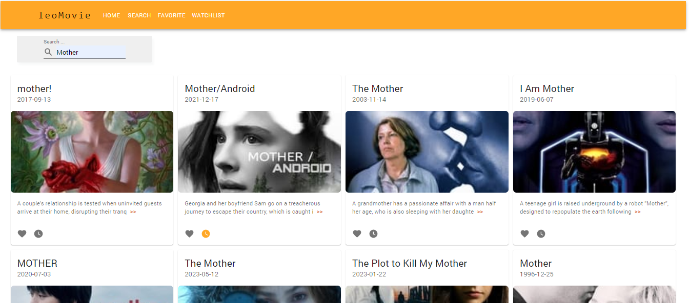
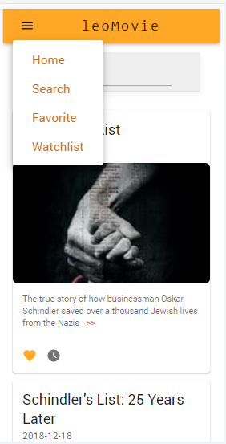

## LeoMovie

A movie discovery application , using **React** and **TypeScript**.

The project integrates with **TMDb API** to search and display movies, manage favorites and watchlist items, and provide a responsive user experience across desktop and mobile devices.  
It also includes unit testing, API mocking, linting, formatting, and a clean reusable component-based architecture.

---

## Built With

[](https://reactjs.org)
[](https://www.typescriptlang.org/)
[](https://mui.com/)
[](https://reactrouter.com/)
[](https://jestjs.io/)
[](https://testing-library.com/)
[](https://mswjs.io/)
[](https://eslint.org/)
[](https://prettier.io/)
[](https://typicode.github.io/husky/)

---

## Features

### **Assessment Requirements**

- Search field and result listing  
  Users can search for movies and view results in a clean responsive interface.

- Favorite movies  
  Users can mark movies as favorites.

- Watch later list  
  Users can save movies to a watchlist for later viewing.

- Responsive design  
  The application is designed to work properly on both desktop and mobile devices.

- Testing  
  Unit tests are included in the repository.

- Demo included  
  Screenshots are provided to demonstrate the application.

---

### **All Functionality**

- Display popular movies from **TMDb**
- Search movies by title
- Add or remove movies from **Favorites**
- Add or remove movies from **Watch Later**
- Dedicated menu/navigation for:
  - Home
  - Favorites
  - Watchlist
- Responsive UI for desktop and mobile
- Reusable component-based architecture
- Unit testing with **Jest** and **React Testing Library**
- API mocking with **Mock Service Worker (MSW)**
- Linting with **ESLint**
- Code formatting with **Prettier**
- Pre-commit hooks with **Husky**
- GitHub CI workflow included

---

## Run Locally

Clone the project

```bash
git clone https://github.com/sarlakZM/leo-movie.git

Go to the project directory

bash
cd leo-movie

Install dependencies

bash
npm install
```

## Development

| Command | Description |
| :------ | :---------- |
| `npm run start` | Start the development server |
| `npm run test` | Run tests and initialize MSW worker |
| `npm run build` | Build the project for production |
| `npm run lint` | Analyze the code with ESLint |
| `npm run lint:fix` | Automatically fix lint issues |
| `npm run format` | Format the code with Prettier |


---

## API Reference

TMDb API Documentation: [developers.themoviedb.org](https://developers.themoviedb.org)

| Function | Method | Reference |
| :------- | :----- | :-------- |
| `Get Popular Movies` | `GET` | [Ref](https://developers.themoviedb.org/3/movies/get-popular-movies) |
| `Get Favorite Movies` | `GET` | [Ref](https://developers.themoviedb.org/3/account/get-favorite-movies) |
| `Get Movie Watchlist` | `GET` | [Ref](https://developers.themoviedb.org/3/account/get-movie-watchlist) |
| `Mark as Favorite` | `POST` | [Ref](https://developers.themoviedb.org/3/account/mark-as-favorite) |
| `Add to Watchlist` | `POST` | [Ref](https://developers.themoviedb.org/3/account/add-to-watchlist) |
| `Search Movies` | `GET` | [Ref](https://developers.themoviedb.org/3/search/search-movies) |
| `Get Account Details` | `GET` | [Ref](https://developers.themoviedb.org/3/account/get-account-details) |
| `Create Request Token` | `GET` | [Ref](https://developers.themoviedb.org/3/authentication/create-request-token) |
| `Create Session` | `POST` | [Ref](https://developers.themoviedb.org/3/authentication/create-session) |

---

## TMDb Authentication Notes

To use TMDb account-related endpoints such as favorites and watchlist, some authentication steps are required:

- Create an account on [TMDb](https://www.themoviedb.org/)
- Get an API key from:
  - https://www.themoviedb.org/settings/api
- Create a request token
- Create a session using the approved token
- Retrieve account details to get the account ID

Required values may include:

- API Key
- Request Token
- Session ID
- Account ID

> Note: Some values in this project were used for testing/demo purposes only.

---

## Environment Variables

To run this project, add the following variables to your `.env` file:

env
REACT_APP_TMDB_API_KEY=
REACT_APP_TMDB_API_BASE_URL=

Optional / testing-only values:

env
REACT_APP_ACCOUNT_ID=
REACT_APP_SESSION_ID=

---

## Development Notes

- **MSW** was added to improve API testing and mocking behavior  
  [More about Mock Service Worker](https://mswjs.io/)

- A centralized `Movies.tsx` and related movie types are used for handling different movie categories and shapes such as:
  - Popular
  - Favorites
  - Watchlist
  - Search results

- The project uses:
  - Reusable components
  - TypeScript types
  - API service abstraction
  - Router-based navigation
  - Jest + React Testing Library
  - MSW for mocked network requests
  - ESLint + Prettier
  - Husky for pre-commit checks
  - GitHub Actions for CI

---

## Project Structure

```
│   .env
│   .eslintrc.json
│   .evn.example
│   .gitignore
│   .prettierrc
│   package-lock.json
│   package.json
│   README.md
│   tsconfig.json
│
├── .github
│   └── workflows
│       └── yaml-ci.yml
│
├── .husky
│   ├── pre-commit
│   └── _
│       ├── .gitignore
│       └── husky.sh
│
├── public
│   ├── assets
│   │   ├── no-results.gif
│   │   ├── themoviedb-demo-mobile.png
│   │   └── themoviedb-demo.png
│   ├── favicon.ico
│   ├── index.html
│   ├── logo192.png
│   ├── logo512.png
│   ├── manifest.json
│   ├── mockServiceWorker.js
│   └── robots.txt
│
└── src
    ├── components
    │   ├── AppBarCustom
    │   ├── Button
    │   ├── Card
    │   └── SearchBox
    ├── features
    │   └── movies
    ├── mocks
    ├── pages
    ├── services
    ├── types
    └── utils
```
---

## Design Decisions

- **React + TypeScript** were chosen for a scalable and strongly typed frontend solution
- **TMDb API** was selected because it provides a rich movie dataset and account-based features
- **Reusable components** were used to keep the UI modular and maintainable
- **MSW** was included to make tests more realistic and less dependent on live APIs
- **Husky + lint-staged** help enforce code quality before commits
- **Responsive design** was prioritized to satisfy the recruitment requirement for both desktop and mobile usability

---

## Demo




---

## Author

**Zahra Sarlak**  
Assignment for [leovegas](https://www.leovegas.com/) [leovegasgroup](https://www.leovegasgroup.com/)
