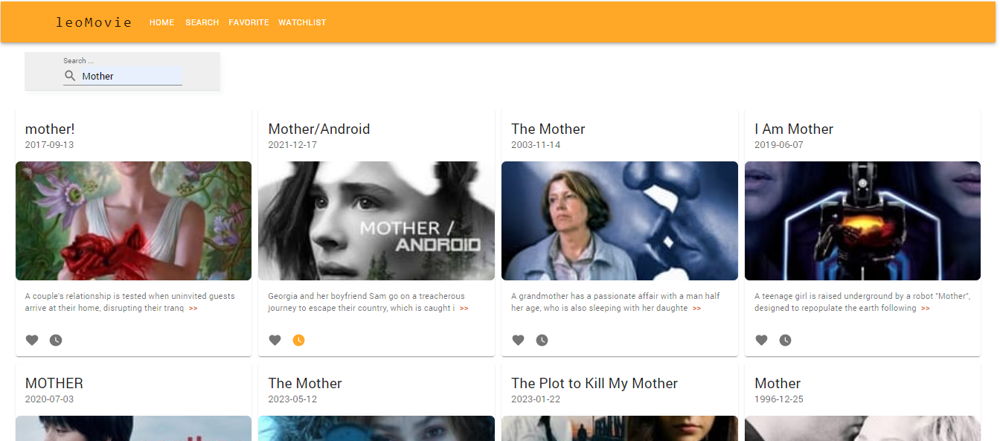

## LeoMovie

This project shows a few films from themoviedb site (this site shows Millions of movies and as a developer, you can use the TMDb API service in your project).

## Built With

[](https://reactjs.org)
[](https://www.typescriptlang.org/)
[](https://eslint.org/)

## Features

**All functionality and showing movies perform from/to the main API on (TMDb )**

- List for showing popular movies
- Possibilty to search for movies on the search page
- Have functionality for setting movies as your favorites, maybe with a star
- Have functionality for setting the movie as Watch later
- A Menu and list where you can see Watchlist and Favorites movies
- Write unit tests

## Run Locally

Clone the project

```bash
  git clone https://link-to-project
```

Go to the project directory

```bash
  cd my-project
```

Install dependencies

```bash
  npm install
```

Start the server

```bash
  npm run start
```

Test the server

```bash
  npm run test
```

Build the server

```bash
  npm run build
```

Analyze statically the code to quickly find problems.

```bash
  npm run lint
  npm run lint:fix
```

Format the code with [Prettier](https://prettier.io/)

```bash
  npm run format
```

## API Reference [TNDb](https://developers.themoviedb.org)

| Function                                | Method | Reference                                                                      |
| :-------------------------------------- | :----- | :----------------------------------------------------------------------------- |
| `Get Popular`                           | `GET`  | [Ref](https://developers.themoviedb.org/3/movies/get-popular-movies)           |
| `Get Favorite Movies`                   | `GET`  | [Ref](https://developers.themoviedb.org/3/account/get-favorite-movies)         |
| `Get Movie Watchlist`                   | `GET`  | [Ref](https://developers.themoviedb.org/3/account/get-movie-watchlist)         |
| `Mark as Favorite`                      | `POST` | [Ref](https://developers.themoviedb.org/3/account/mark-as-favorite)            |
| `Add to Watchlist`                      | `GET`  | [Ref](https://developers.themoviedb.org/3/account/add-to-watchlist)            |
| `Search Movies`                         | `GET`  | [Ref](https://developers.themoviedb.org/3/search/search-movies)                |
| `Get Details ( like account id)Account` | `GET`  | [Ref](https://developers.themoviedb.org/3/account/get-account-details)         |
| `Create Request Token`                  | `GET`  | [Ref](https://developers.themoviedb.org/3/authentication/create-request-token) |
| `Create Session`                        | `POST` | [Ref](https://developers.themoviedb.org/3/authentication/create-session)       |

**Notes** GET API KEY, SESSION ID, TOKEN ID, ACCOUNT ID
There are some sequence processes for getting an account id:

- Create account on https://www.themoviedb.org/ website to getting API Key (https://www.themoviedb.org/settings/api)
- Create a Request Token for getting token id ( need an API key)
- Create a Session for getting session id ( need API key and token id)
- Get Detail Account (account id) ( need API key, session id), In the process you have to approve the permission of using the account id.

For getting the Account id manually without calling their methods I used this online http://dev.travisbell.com/ website and finally get the account id.

To run this project, you will need to add the following environment variables to your .env file

- `REACT_APP_TMDB_API_KEY`
- `REACT_APP_TMDB_API_BASE_URL`

It's just for testing. and don't use these variables manually in your project :

- `REACT_APP_ACCOUNT_ID`
- `REACT_APP_SESSION_ID`

## Development

- Adding MSW package to test API in a better way. (It is just a bit little sample that was created in the mocks folder) [More Info about Mock Service Worker](https://mswjs.io/)
- Using one-page Movies.tsx for movie type and its shapes e.g favorites, watchlist, popular, search. (there are other types like audio, image, and video)
- Using resue components, constants, services(APIs), routers, react test|jest|msw, Typescript, Eslint, prettier, husky
- Using CI Github for testing repo project

## View(Demo) of project




## Project structure (tree /f)

```
│   .env
│   .eslintrc.json
│   .evn.example
│   .gitignore
│   .prettierrc
│   package-lock.json
│   package.json
│   README.md
│   tsconfig.json
│
├───.github
│   └───workflows
│           yaml-ci.yml
│
├───.husky
│   │   pre-commit
│   │
│   └───_
│           .gitignore
│           husky.sh
│
├───public
│   │   favicon.ico
│   │   index.html
│   │   logo192.png
│   │   logo512.png
│   │   manifest.json
│   │   mockServiceWorker.js
│   │   robots.txt
│   │
│   └───assets
│           no-results.gif
│           themoviedb-demo-mobile.png
│           themoviedb-demo.png
│
└───src
    │   App.test.tsx
    │   App.tsx
    │   index.tsx
    │   react-app-env.d.ts
    │   reportWebVitals.ts
    │   setupTests.ts
    │
    ├───components
    │   │   ErrorBoundary.test.tsx
    │   │   ErrorBoundary.tsx
    │   │   ErrorMessage.styles.tsx
    │   │   ErrorMessage.test.tsx
    │   │   ErrorMessage.tsx
    │   │   RouteHandler.test.tsx
    │   │   RouteHandler.tsx
    │   │
    │   ├───AppBarCustom
    │   │       AppBarCustom.test.tsx
    │   │       AppBarCustom.tsx
    │   │       BoxItems.test.tsx
    │   │       BoxItems.tsx
    │   │       Logo.test.tsx
    │   │       Logo.tsx
    │   │       MenuItems.styles.tsx
    │   │       MenuItems.test.tsx
    │   │       MenuItems.tsx
    │   │
    │   ├───Button
    │   │       FavoriteButton.test.tsx
    │   │       FavoriteButton.tsx
    │   │       WatchLaterButton.test.tsx
    │   │       WatchLaterButton.tsx
    │   │
    │   ├───Card
    │   │       CardItem.styles.tsx
    │   │       CardItem.test.tsx
    │   │       CardItem.tsx
    │   │       CardList.test.tsx
    │   │       CardList.tsx
    │   │       CardMediaItem.test.tsx
    │   │       CardMediaItem.tsx
    │   │
    │   └───SearchBox
    │           SearchBox.styles.ts
    │           SearchBox.test.tsx
    │           SearchBox.tsx
    │
    ├───features
    │   └───movies
    │           Movies.test.tsx
    │           Movies.tsx
    │
    ├───mocks
    │       browser.ts
    │       handlers.ts
    │       mock.data.ts
    │       mockHttpServer.ts
    │       setupTests.ts
    │
    ├───pages
    │       Home.tsx
    │
    ├───services
    │       baseApi.test.ts
    │       baseApi.ts
    │       movieApi.test.ts
    │       movieApi.ts
    │
    ├───types
    │       Api.types.ts
    │       App.types.ts
    │       Movie.types.ts
    │       Router.types.ts
    │
    └───utils
            constants.ts
            routes.tsx
            system.message.ts
            utils.ts

```
